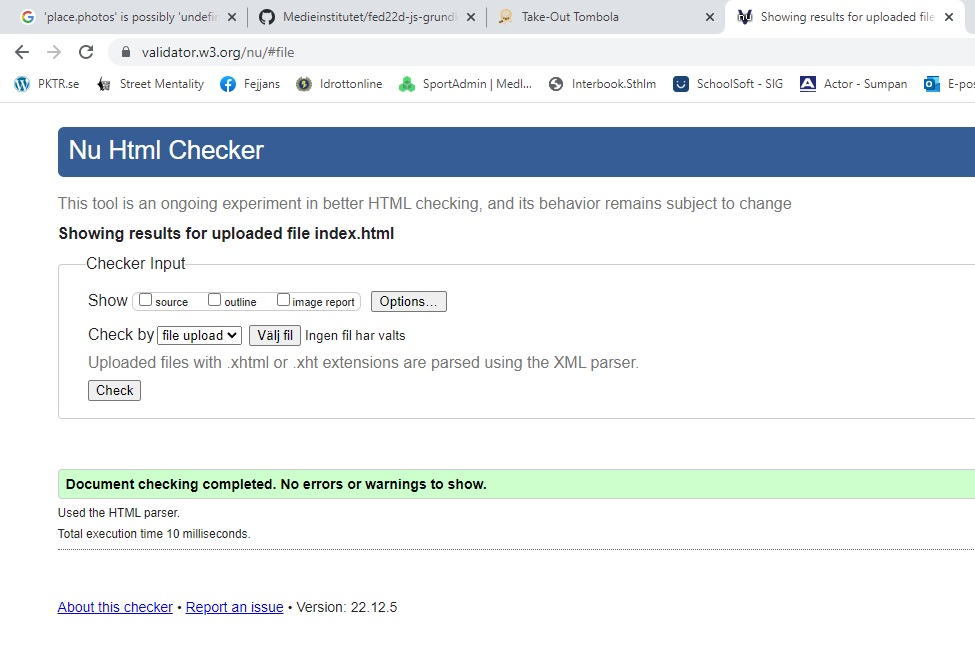
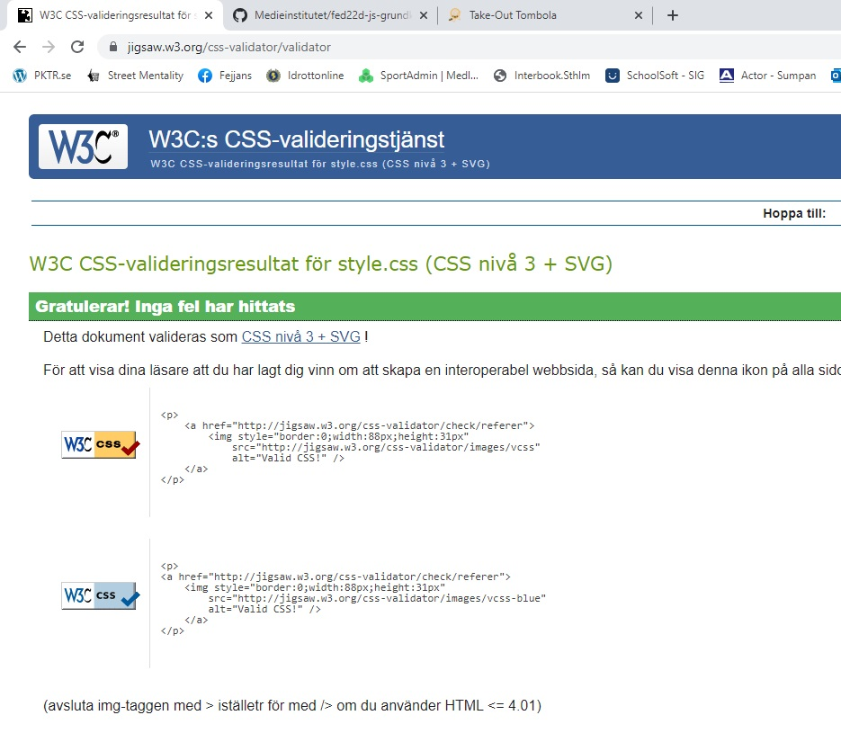
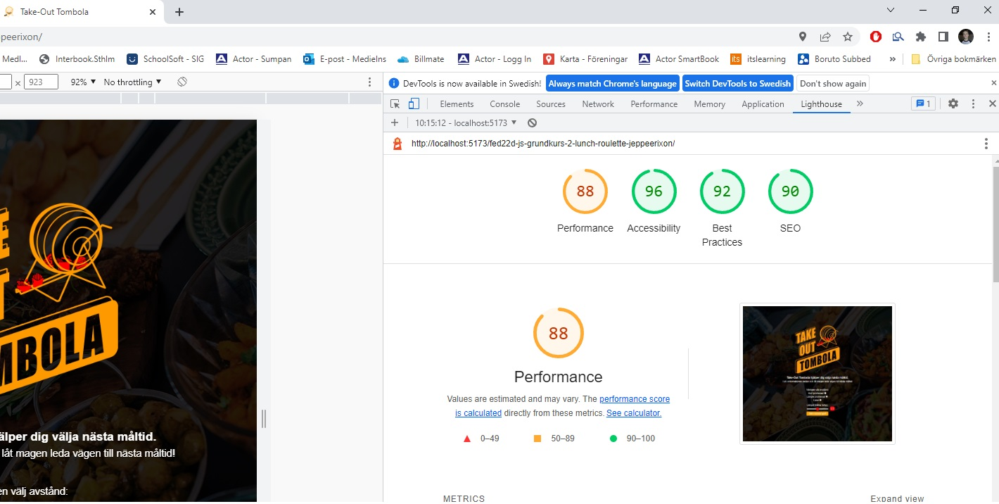

## LINK TO MY WEBSITE
https://medieinstitutet.github.io/fed22d-js-grundkurs-2-lunch-roulette-jeppeerixon/
Individual project in the javascript basic course at Medieinstitutet Front End Developer program. 
Focus was to learn TypeScript and also how to use an external API, Google Maps Places API.

## Tech stack:
TypeScript, , GoogleMapsAPI, HTML & SCSS, Vite, NodeJS

## HTML VALIDATION

## CSS VALIDATION

## LIGHTHOUSE VALIDATION

